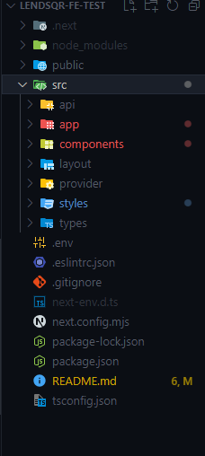

This is a frontend test taken in fulfuilment of the lendsqr frontend aptitude test

[Link to website]()

Table Of contents
- [Introduction](#Introduction)
  - [Tools used](#tools-used)
- [My Process](#my-process)
  - [File Arrangement](#file-arrangement)
- [Summary](#summary)

## Introduction

This project is built using NextJs, SASS and Mocky.io

### Tools Used

- NextJs: The fullstack framework used in buidling the UI and consuming the api. The version used was NextJs 14.2.4, using the app router, and typescript.

- SASS: The styling framwork used for adding style and beauty to the website, responisble for it's display on all screen sizes

- Mocky.io: The mock api generator used in getting the user details that were displayed in the project

- Axios: This was used to fetch the data

## My Process

In building this test for the web application, I followed these processes

- Analysing the Design: The first thing I did was to look through the design. This process is crucial as I used it to see the components needed, and give me insight to the level of abstraction I needed to do for the application.

- Creating the app: Then I bootstraped the application with NextJs, according to specifications.

- Creating of variables and components: After the analysis of the application, I started to pick out the core resources from the figma which are to be used on the application. Then I proceeded to create dynamic resuable components, which were to be used througout the application.

- Building out the UI: Following the specifics of the design, I then proceeded to build out the UI, with the required functionality as seen in the design.

During this process, I had to opt to use axios alone, as @tanstack/react-query was giving me some issues. So, I decided to do everything manually, and optimise the rendering process myself.

I also learned how to use mocky.io. Basically, I had read through the UI, and seen the necessary requirements to make, then I had to generate more dummy Nigerian users, to be able to allow for more roboust feel to the application, then, I wrote code that used the data I had harvested to generate an array of 500 objects, which I then fed to the mock API generator to generate my data.

So, for each use case, each userId remains different, as they were created randomly by code I used to generate random data so as to populate the database.

### File Arrangement

So, this is how the file arrangement looks

## Summary

Building this application, and its responsiveness to ensure maximum functionality was fun, as it helped me learn some new techniques when it comes to code optimisation and handling large data.